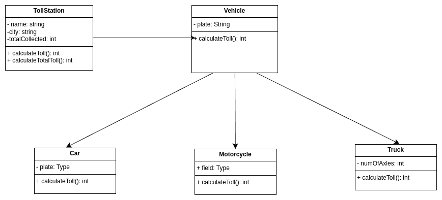
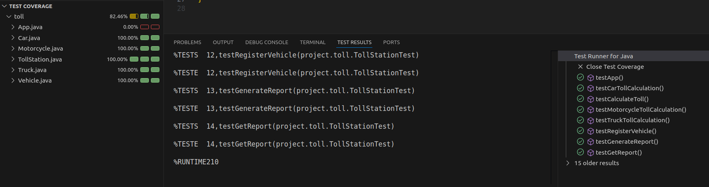

# Sistema de Peaje 🚗🏍️🚛

Este proyecto modela un **sistema de peaje** que calcula y registra el costo de peaje de diferentes tipos de vehículos que pasan por una estación. El sistema utiliza **herencia** para gestionar las características comunes de los vehículos y diferenciar los costos según el tipo de vehículo.

## Características principales

- **Tipos de vehículos soportados**:
  - **Coche**: Peaje fijo de $100.
  - **Moto**: Peaje fijo de $50.
  - **Camión**: Peaje calculado en función del número de ejes ($50 por eje).
- **Estación de peaje**:
  - Registra vehículos.
  - Calcula el total acumulado de peajes recolectados.
  - Genera un reporte detallado de los vehículos registrados y el monto total.

---

## Estructura del proyecto

El proyecto utiliza una estructura modular con las siguientes clases:

- **`Vehicle`**: Clase abstracta que representa un vehículo genérico. Las clases específicas heredan de esta.
- **`Car`**: Representa un coche.
- **`Motorcycle`**: Representa una moto.
- **`Truck`**: Representa un camión (con número de ejes).
- **`TollStation`**: Gestiona los vehículos que pasan por la estación y calcula el total de peajes.
- **`App`**: Clase principal que ejecuta el programa.

---

## Requisitos previos

Asegúrate de tener instalado lo siguiente:

- **Java Development Kit (JDK)** versión 8 o superior.
- Un entorno de desarrollo compatible, como IntelliJ IDEA, Eclipse, o VS Code.

---

## Diagrama de Clases

A continuación, se incluye el diagrama UML que ilustra las relaciones entre las clases principales del proyecto. Puedes visualizar el diagrama en la siguiente imagen:

---

---

## Pruebas Unitarias

A continuación, se incluye el diagrama UML que ilustra las relaciones entre las clases principales del proyecto. Puedes visualizar el diagrama en la siguiente imagen:

  - Cobertura completa de métodos clave en las clases.
  - Validación del comportamiento bajo diferentes escenarios.
   

---
Autor
Yuliana Alcalá